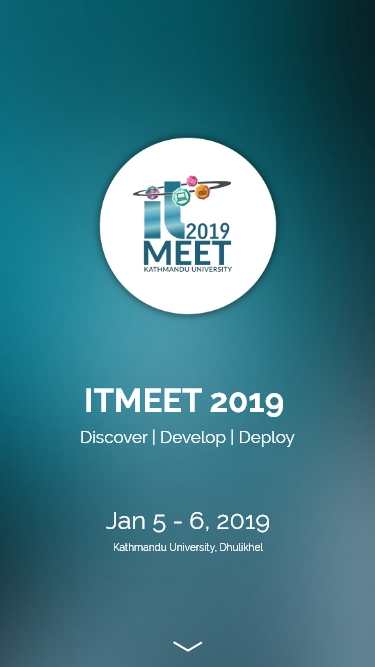
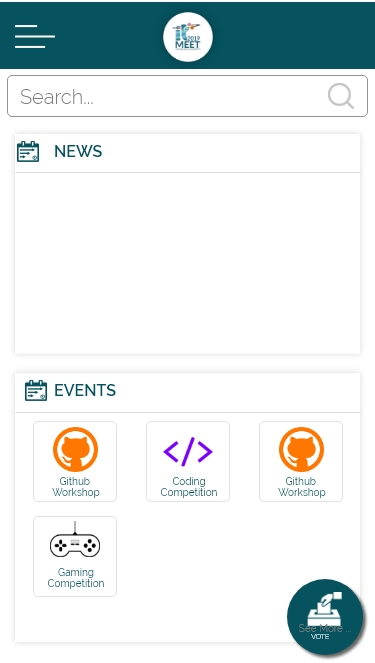
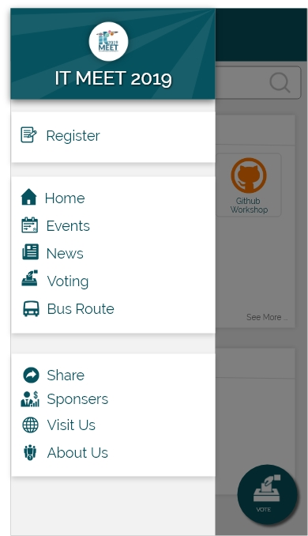
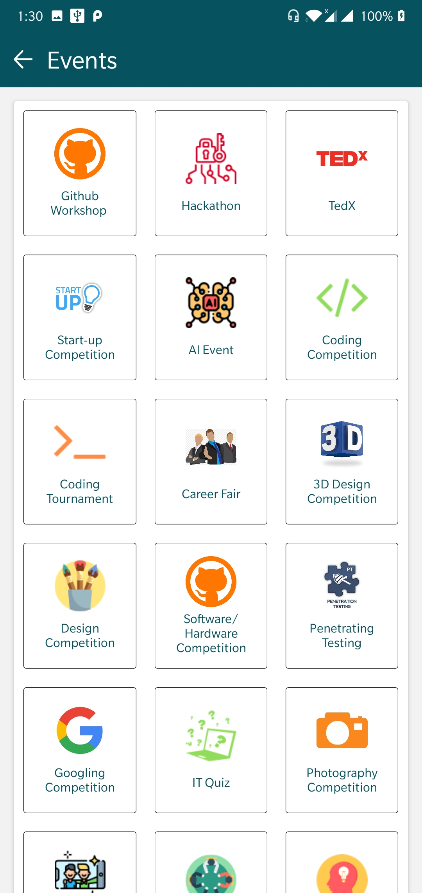
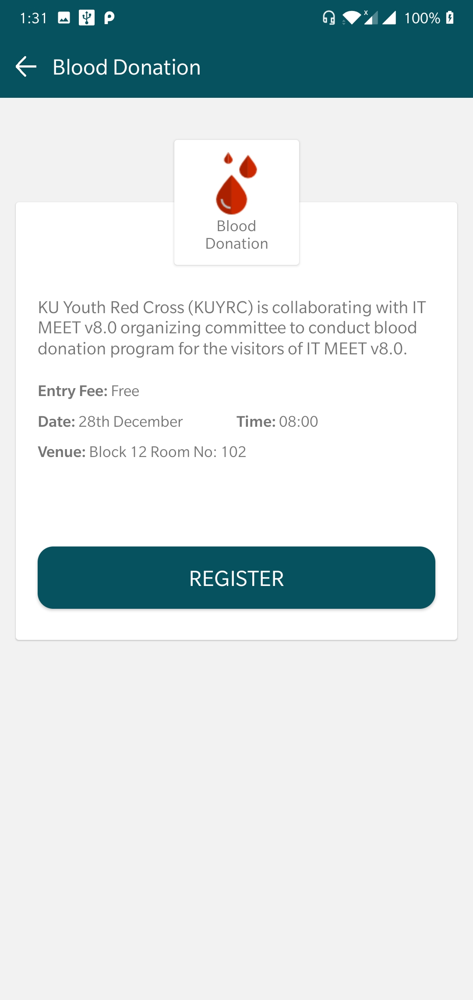
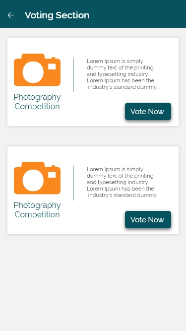
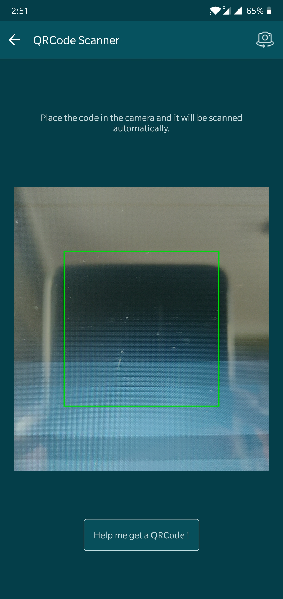

# Mobile Application for IT MEET v8.0.

## Tools Used
  <ul>
  <li>React Native CLI</li>
  <li>Android Studio </li>
  <li>Nodejs</li>

## Screenshots of the App

### Landing Page

### Home Page

### Drawer

### Events Page

### Individual Event Page

### Voting Page

  
 
